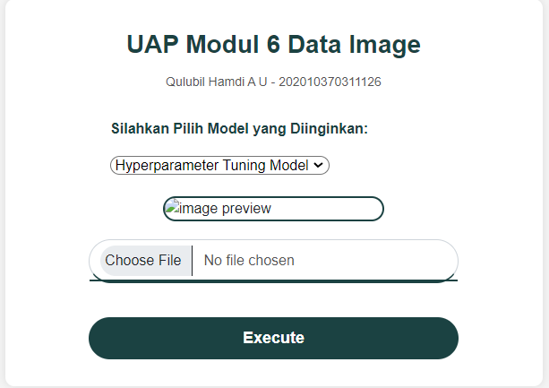
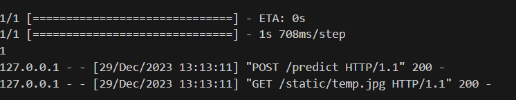

# UAPML

# Overview Repository
Repository ini berisi pengerjaan Ujian Akhir Praktikum Mata Kuliah Pembelajaran Mesin.
Pengerjaan ini menggunakan dataset image dengan permasalahan yaitu prediksi model Hyoerparameter Tuning.

Library yang digunakan:
1. Flask
2. Keras
3. OpenCV
4. Pillow
5. Numpy Array

# Overview Process
1. Tampilan awal
   
   Pada tampilan awal adalah seperti ini, tampilan dibuat bersih dan rapi dengan judul, sub-judul, option box model, preview image, upload image button, dan execute button.
   
2. Upload Image
   .png)
   Berikut adalah tampilan setelah salah satu image dari dataset ditampilkan.

3. Execute Image
   
   Berikut adalah proses ketika gambar dilakukan model training.
   
5. Result
   .png)
   Berikut adalah salah satu contoh hasil result dari proses training model. Terdapat informasi mengenai preview hasil input image, hasil prediksi model, Accuracy, dan Prediction Time.

## 👩‍💻👩‍💻 Authors

- [@qulubilhamdi_](https://www.github.com/QulubilHamdiAU)
